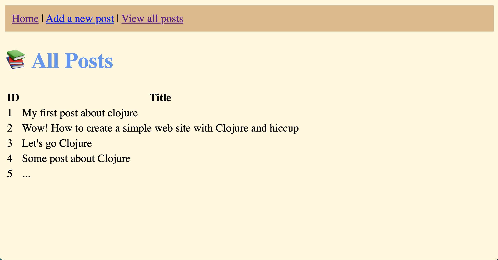

# Site

## Description

This is a simple site for study purposes.

## How to run

1. Clone this repository

    ...

2. Create the Database

Open terminal and execute the following commands:

```bash
clj

Clojure 1.11.1
user =>
```

And then:

```clj
  user=> (require '[next.jdbc :as jdbc] '[next.jdbc.sql :as sql])
  nil
  ;; a hash map that describes the database we plan to use:
  user=> (def db {:dbtype "h2" :dbname "./my-db"})
  #'user/db
  ;; execute a single statement to create the posts table:
  user=> (jdbc/execute-one! db ["
  CREATE TABLE posts (
    id bigint primary key auto_increment,
    title VARCHAR(255),
    content TEXT
  )
  "])
  #:next.jdbc{:update-count 0}
  ;; insert a single row of data into that table:
  user=> (sql/insert! db :posts {:title "My First Post" :content "This is my first post. Clojure 🎉"})
  #:POSTS{:ID 1} ; the generated key(s) from the insert
  user=>
```

3. Run server and install dependencies

```bash
clojure -M -m web.handler
```

4. Access localhost:3000 and enjoy!



## Roadmap

- [x] List posts
- [ ] Add new post
- [ ] Edit post
- [ ] Delete post
- [ ] Show specific post
- [ ] Search a post

## License

MIT License © 2023 [Aristóteles Coutinho](https://aristotelescoutinho.com.br) 💚
